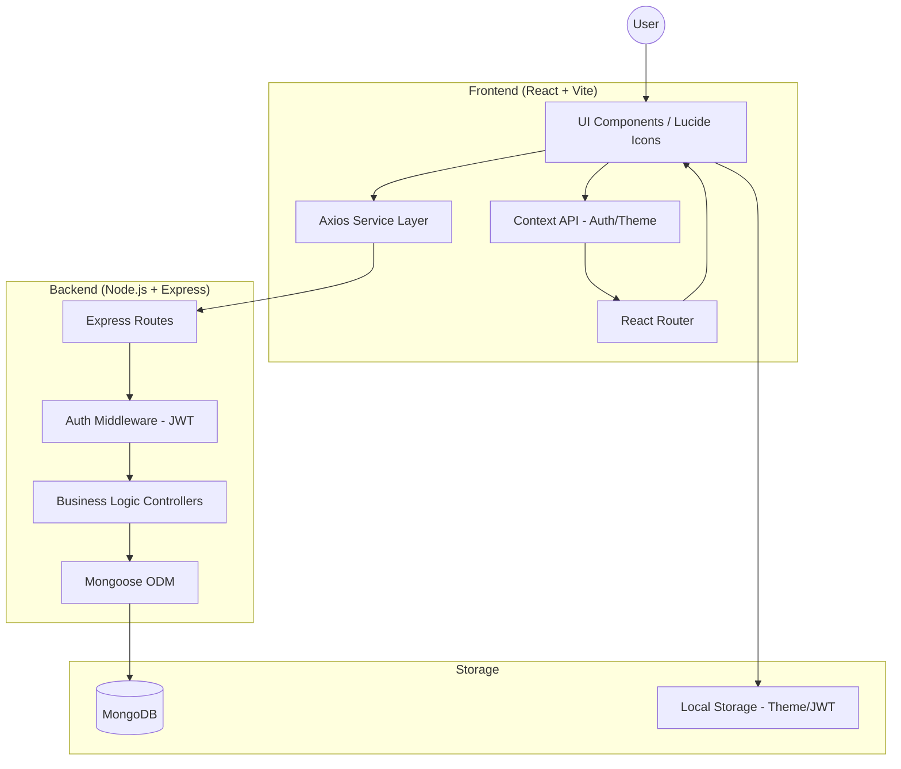
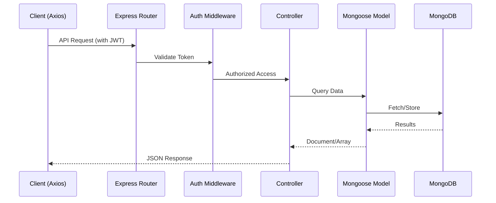
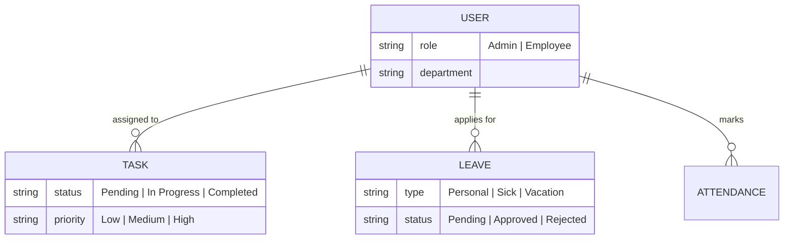

# Alpha One - Professional Employee Management System

Alpha One is a high-performance, visually stunning Employee Management System built with the MERN stack. It features a premium "Alpha" aesthetic with glassmorphism, dynamic gradients, and a streamlined user experience for both administrators and employees.

## ✨ Features

- **Premium UI/UX**: Modern glassmorphism design with Tailwind CSS v4, custom violet/indigo theme, and smooth animations.
- **Role-Based Access Control**: Secure login and signup for both `Admin` and `Employee` roles.
- **Admin Mission Control**:
  - Full employee directory management (Hire/Manage).
  - Task deployment and monitoring across the organization.
  - Leave request review system (Approve/Reject).
  - Real-time attendance and session tracking logs.
- **Employee Workspace**:
  - Personal dashboard with key activity metrics and daily affirmations.
  - Interactive mission board for tracking and updating assigned tasks.
  - Simple leave application and status tracking.
  - One-click "Clock In/Out" session management.
- **Security**: JWT-based authentication with bcrypt password hashing and protected API routes.

## 🚀 Tech Stack

- **Frontend**: React.js 19 (Vite), Tailwind CSS v4, Lucide React (Icons).
- **Backend**: Node.js, Express.
- **Database**: MongoDB (Mongoose ODM).
- **Styling**: Modern CSS with Glassmorphism and Backdrop Filters.

## 🛠️ Getting Started

### Prerequisites

- Node.js installed.
- MongoDB running locally.

### Installation

1. **Clone the repository**:
   ```bash
   git clone https://github.com/your-username/EmployeeManagement-AlphaOne.git
   cd EmployeeManagement-AlphaOne
   ```

2. **Backend Setup**:
   ```bash
   cd backend
   npm install
   # Create a .env file with MONGODB_URI and JWT_SECRET
   node server.js
   ```

3. **Frontend Setup**:
   ```bash
   cd ../frontend
   npm install
   npm run dev
   ```

4. **Automated Setup (Mac/Linux)**:
   Run the provides script to start MongoDB (via brew), seed the admin user, and launch the system:
   ```bash
   ./start.sh
   ```

## 🔐 Default Credentials (Admin)

- **Email**: `admin@ems.com`
- **Password**: `adminpassword123`

## 💎 Design Philosophy

Alpha One follows the **Glass-morphism** design trend, utilizing:
- `backdrop-blur` for semi-transparent, high-end container effects.
- Sophisticated `slate-950` backgrounds with primary `violet` radial accents.
- High-contrast, bold typography for clarity and impact.

## ⛩️ System Design

Detailed technical architecture and data flow diagrams.

### 🏗️ High-Level Architecture
Alpha One follows a modern MERN stack architecture.



### ⚙️ Backend Architecture (MVC)
The backend follows a strict Model-View-Controller (MVC) pattern.



### 📊 Data Model (ERD)


---
Built with ❤️ by Alpha One Team (Prasad Patharvat).
